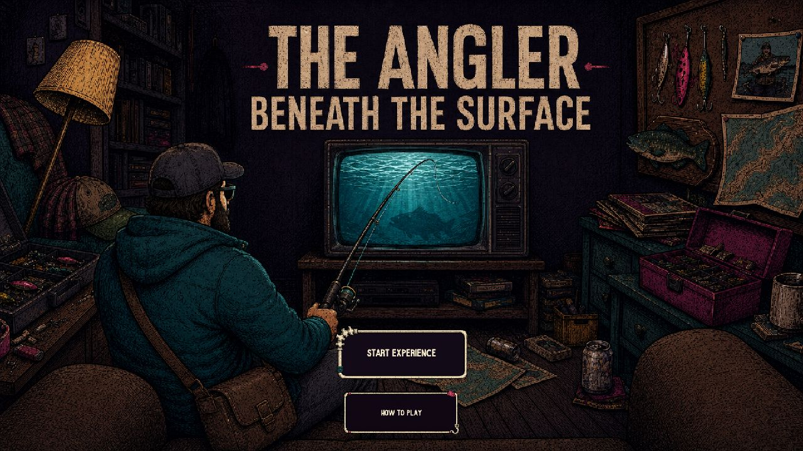
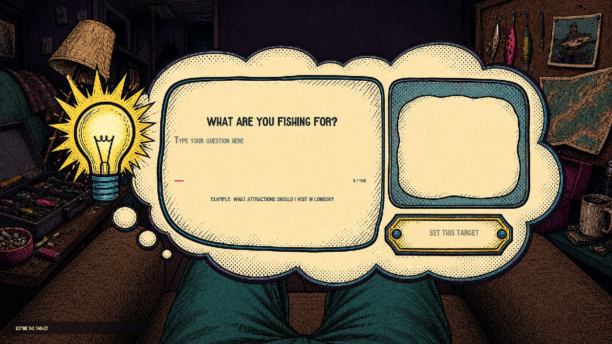
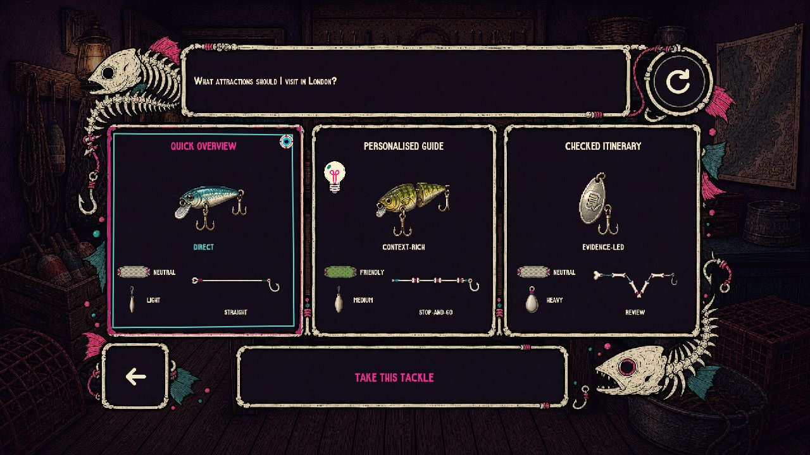
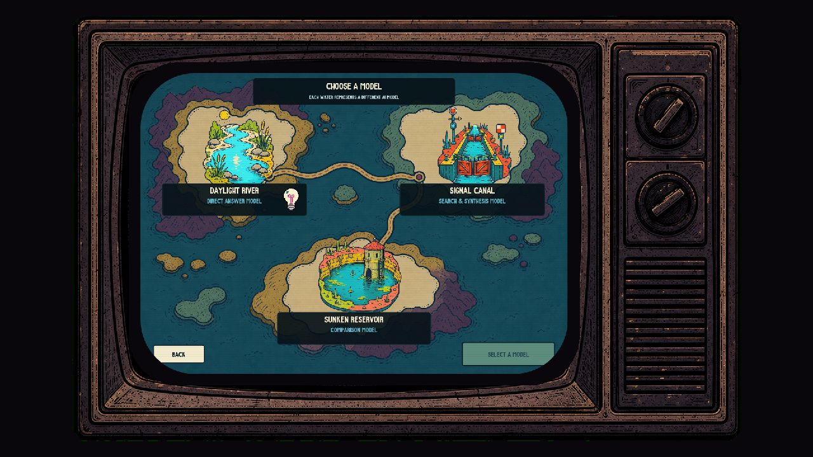
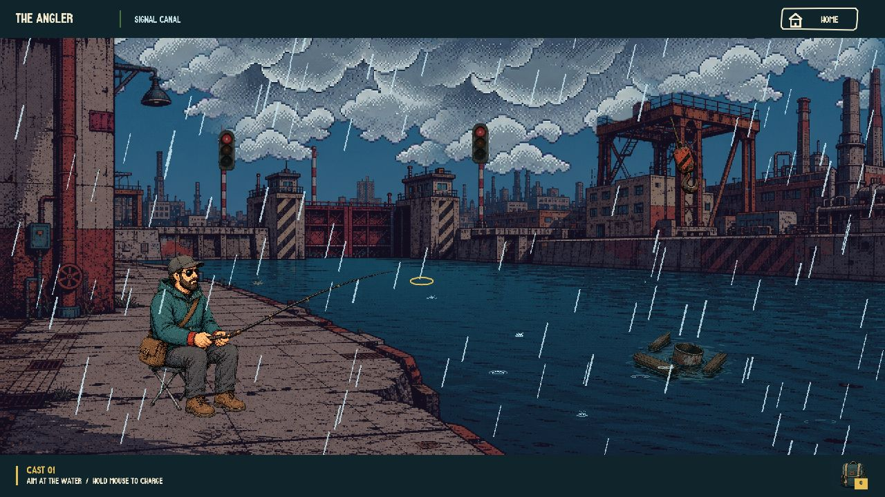
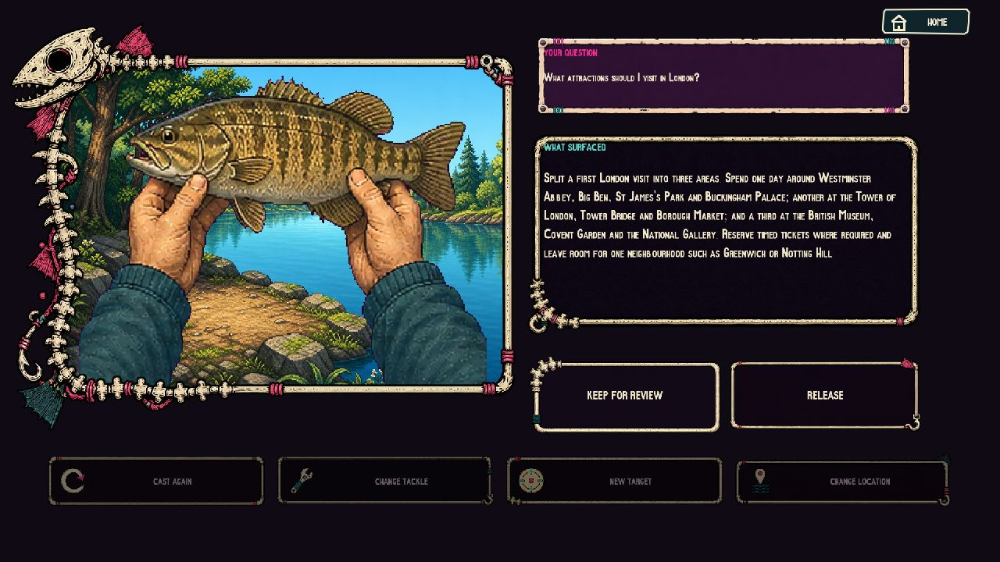
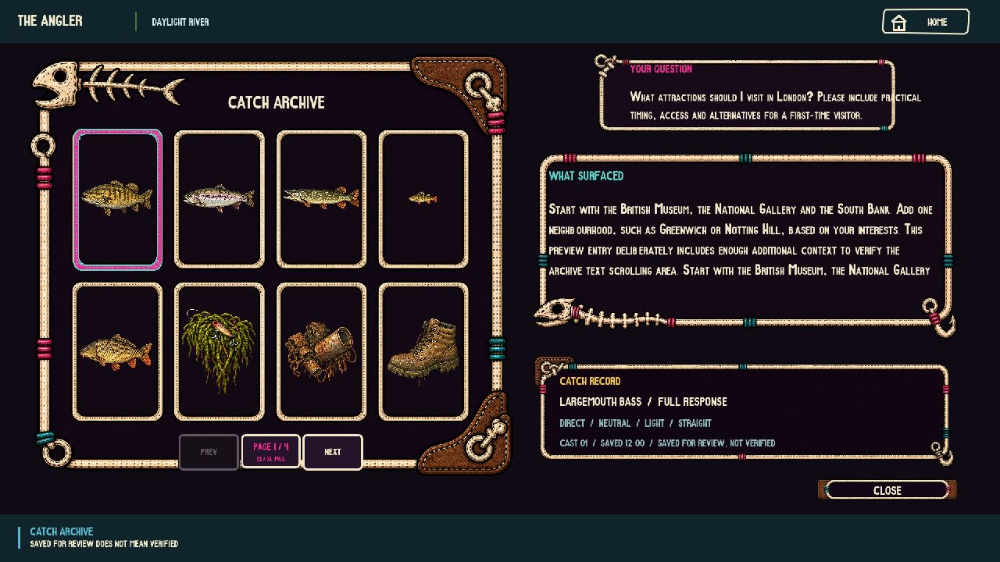

# The Angler: Beneath the Surface?



**Aaron Jiang · Final Major Project · 2026**<br>
**Project video:** [https://youtu.be/Y5l-pW4MElk](https://youtu.be/Y5l-pW4MElk)

## Overview

*The Angler: Beneath the Surface?* is a screen-based interactive artwork that turns AI prompting into a fishing experience. A visitor enters a question, chooses a way to approach it, selects a water and tackle configuration, casts, waits and lands a generated response. The result must then be read, kept for review or released.

Fishing is used as an operating structure rather than decoration. The visitor can prepare the cast and influence the form of the response, but cannot completely determine what will surface. A large or convincing catch is not automatically a correct answer, and saving a catch never means that it has been verified. The work asks how intention is formed, revised and judged while interacting with a probabilistic system.

## Audience Experience



The experience is designed for one participant at a time, with the screen visible to nearby viewers.

1. Enter a question or use the built-in London example.
2. Review the suggested tackle configurations and choose how the answer should be structured.
3. Select one of three waters, each representing a different response strategy.
4. Read the weather, aim at the water and hold the mouse to charge the cast.
5. Release to cast, wait for a bite and control the line tension.
6. Read the surfaced response and choose to keep it for review, release it or cast again.
7. Open the Catch Archive to compare saved responses. Saved catches remain explicitly unverified.

<p align="center">
  
  
</p>

The three waters frame different response strategies: **Daylight River** favours direct answers, **Signal Canal** uses search-and-synthesis framing, and **Sunken Reservoir** supports comparison and trade-off analysis. Nine tackle profiles vary response type, tone, length and organisation without claiming that any option is necessarily correct.

Five weather states—Clear, Overcast, Fog, Rain and Storm—change the atmosphere, bite timing, reaction window and catch probability. Eight outcomes can surface: bass, trout, pike, perch, carp, weeds, rubbish or an old boot. These categories describe the form of a response and provide cues for critical reading; they are not factual-accuracy scores.



<p align="center">
  
  
</p>

## Controls

- Use the **mouse** to select interface options and position the cast.
- **Hold the mouse** to charge the rod; release it to cast.
- During retrieval and landing, hold to pull and release to ease the line tension.
- Use the **mouse wheel** to read long response and archive panels.
- Hold **Space** to skip a cutscene. Use **Escape** to close a panel or return from the current interaction where available.

The artwork is designed for a 1920 × 1080 display in a current Chromium-based browser. Sound begins after the first user interaction because browsers block automatic audio playback.

## Run Locally

### Requirements

- Node.js 20 or newer;
- a modern browser;
- an OpenAI API key for live questions. The unchanged built-in London example has a limited presentation reserve for exhibition continuity.

### Install and configure

```powershell
npm.cmd install
Copy-Item .env.example .env
```

Open `.env` and add the real key:

```dotenv
OPENAI_API_KEY=your_key_here
```

The remaining model, host and port defaults are already provided in `.env.example`. Never commit `.env` or place the API key in front-end code.

### Check and start

```powershell
npm.cmd run preflight
npm.cmd run check
npm.cmd test
npm.cmd start
```

Open [http://localhost:3001](http://localhost:3001) and keep the server terminal running. Press `Ctrl + C` in that terminal to stop the server.

## Technical Overview

The front end is a p5.js canvas application with separate modules for interaction flow, game rules, AI requests, audio and answer shaping. A local Node.js server validates the visitor's choices, keeps the OpenAI key outside the browser, calls the OpenAI Responses API and returns text bound to a single cast record. Timeouts, duplicate requests, moderation failures and missing responses enter visible recovery states rather than becoming fabricated catches.

The current automated suite contains **92 tests** covering request validation, timeouts, retry behaviour, catch probability, state transitions, audio integrity, exhibition screening, presentation-reserve matching and server security.

## Visual Production and AI Use

The storyboards, character actions, fish, water compositions and interface direction began as drawings made by the author in Procreate. These drawings were supplied as visual references to OpenAI image-generation tools to develop more resolved candidate assets. The author directed the prompts, selected and rejected results, checked content against the storyboard, and completed cropping, transparency cleanup, colour matching, layer separation, animation timing and game integration.

The concept, fishing metaphor, interaction flow, Procreate sketches, art direction, candidate selection, manual integration, testing and final acceptance decisions were author-led. AI-assisted imagery is therefore part of the production process, not the sole author of the work.

ChatGPT and Codex were also used for explanation, debugging, code restructuring and documentation support. All suggestions were reviewed and retained only after browser or automated testing.

## Project Structure

```text
public/       Runtime fonts, images, audio and browser modules
server/       OpenAI, reliability, answer-method and exhibition modules
tests/        Automated Node.js test suite
tools/        Startup, preflight and asset-audit utilities
docs/         Asset inventories, deployment notes and README images
index.html    Browser entry page
sketch.js     Main p5.js scene, animation and interaction code
style.css     Page and canvas layout
app.js        Local server and OpenAI route
```

## Credits and Licence

Active audio assets were downloaded from Pixabay and are used under the [Pixabay Content License](https://pixabay.com/service/license-summary/). Creator names, asset IDs, roles, volume settings and integrity hashes are recorded in `public/audio/manifest.json` and the submitted project documentation.

The project uses p5.js, Node.js, local font files and the OpenAI API. Complete research references, technical discussion, testing evidence, exhibition records and the full AI-use declaration are provided in the accompanying English project documentation PDF.
