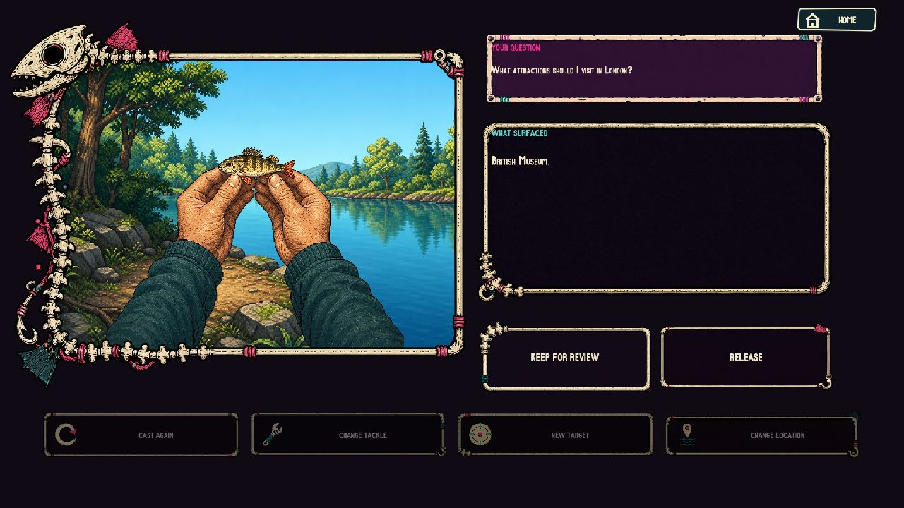
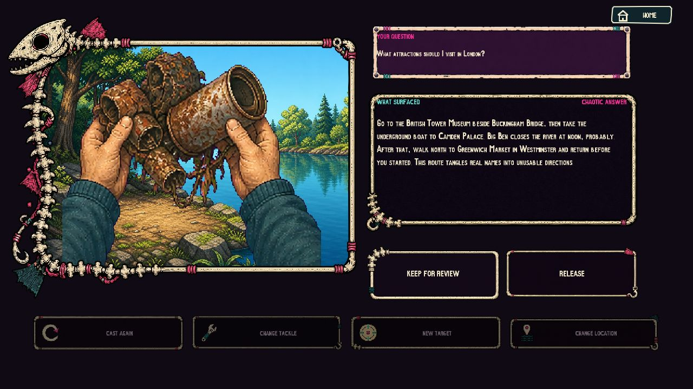
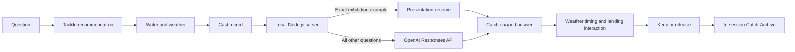

# The Angler: Beneath the Surface?


**Author:** Aaron Jiang

**Project type:** Final Major Project / screen-based interactive artwork

**Year:** 2026

**Primary interaction:** Mouse
**Runtime:** Browser-based p5.js experience with a local Node.js and OpenAI service

*The Angler: Beneath the Surface?* turns asking an AI a question into a fishing expedition. The player chooses how to phrase the request, where to cast it, waits through uncertain conditions, lands a response, and then decides whether the result deserves to be kept. The work uses the familiar pleasure of a fishing game to make a normally hidden AI process physical, slow and open to judgement.

The central proposition is simple: a large catch is not automatically a good answer. A short response may be useful, an impressive response may be overloaded, and a convincing response may still be stale, chaotic or wrong. The work therefore ends with review rather than generation.

## Audience Experience

The experience is designed for one participant at a time, with the screen visible to nearby viewers.

1. Start the experience from the cover.
2. Type a question, or select the built-in London example.
3. Choose a target and review three suggested tackle configurations.
4. Select a water location, which frames a different answer strategy.
5. Read the weather conditions, charge the rod and cast.
6. Wait while the answer is generated. Weather changes the feel of the wait and the difficulty of landing the catch.
7. React to the bite, control the line and land the response.
8. Read what surfaced and decide whether to keep it for review or release it.
9. Revisit saved catches in the Catch Archive. Saving a response does not verify it.


The built-in example is `What attractions should I visit in London?`. Questions are limited to 400 characters so they remain readable within the visual interface.

## Conceptual Mapping

| Game element | AI-related meaning |
| --- | --- |
| Target fish | The user's question or intended information need |
| Tackle | Prompt structure, tone, requested length and answer organisation |
| Water location | A model-routing and answer-strategy profile |
| Weather | External uncertainty: delay, unclear feedback and loss of control |
| Casting | Submitting the request |
| Waiting for a bite | Server and model generation time |
| Landing the fish | Receiving and holding onto a generated response |
| Catch type | A visible reading of the answer's form, not an objective truth score |
| Keep / Release | Human editorial judgement after generation |
| Catch Archive | Saved material that remains explicitly unverified |

The metaphor deliberately separates *generation* from *verification*. The game can shape a response into a particular catch category, but it does not claim that the answer has been fact-checked. The player must still read it, compare it with the question and decide what to do next.

## Prompting as Tackle

The project contains nine named tackle profiles assembled from four prompt dimensions:

- **Type:** direct, context-rich, example-guided, clarifying, comparative or evidence-led;
- **Tone:** neutral, friendly, formal or critical;
- **Weight:** light, medium or heavy;
- **Retrieve pattern:** straight, stop-and-go, review or step-by-step.

The interface recommends three appropriate profiles for the current question rather than exposing raw prompt engineering syntax. The player can compare their trade-offs before choosing.


The nine available profiles are Quick Overview, Personalised Guide, Checked Itinerary, Compare Options, Local Feel, Careful Start, Match an Example, Question the List and Verify Details.

## Water Locations

The three water locations present different conceptual answer strategies:

| Location | Interface model | Intended behaviour |
| --- | --- | --- |
| Daylight River | Direct Answer Model | General, clear and direct responses |
| Signal Canal | Search & Synthesis Model | Search-oriented framing and synthesis of official or experiential perspectives |
| Sunken Reservoir | Comparison Model | Comparison, route breakdowns and analysis of trade-offs |


The server supports separate model environment variables for the three waters, but falls back to the configured default model when no water-specific override is supplied. In the current installation, Signal Canal is a **search-oriented interaction metaphor**; no live web-search tool is attached to the OpenAI request. Its answers must not be described as independently verified web research.

## Weather and Catch Probability

Weather represents conditions outside the participant's control. It affects bite delay, cue visibility, reaction windows, line tension and the risk of losing a response. It does not rewrite the user's question or alter the chosen tackle.

| Weather | Bass | Trout | Pike | Perch | Carp | Weeds | Rubbish | Boot |
| --- | ---: | ---: | ---: | ---: | ---: | ---: | ---: | ---: |
| Clear | 24% | 24% | 12% | 18% | 12% | 4% | 3% | 3% |
| Overcast | 20% | 21% | 13% | 20% | 13% | 5% | 5% | 3% |
| Fog | 17% | 18% | 13% | 22% | 13% | 7% | 6% | 4% |
| Rain | 17% | 18% | 13% | 22% | 12% | 7% | 7% | 4% |
| Storm | 13% | 15% | 12% | 24% | 12% | 9% | 9% | 6% |

Each row totals 100%. Storms increase the probability of small, tangled, chaotic and stale catches, while clear weather favours substantial and useful responses. There is no forced “small fish after three casts” rule.


## What Can Surface

The project uses eight catch categories. These categories are designed as prompts for critical reading, not as automated claims of factual correctness.

| Catch | Response form | Critical reading cue |
| --- | --- | --- |
| Largemouth Bass | Full response | Substantial and structured, but still requires checking |
| Rainbow Trout | Useful answer | Focused and practical, but selective |
| Northern Pike | Confident answer | Decisive language can conceal uncertainty |
| Yellow Perch | Brief answer | Extremely short and potentially useful, but incomplete |
| Common Carp | Overloaded answer | Quantity obscures priority and conclusion |
| River Weed | Off-course answer | Starts near the question and then drifts away |
| River Rubbish | Chaotic answer | Repetition, contradiction and distorted structure |
| Old Boot | Stale answer | Related information with unresolved date or current validity |

### A full response


### A minimal response



### A chaotic response



The catch artwork makes answer shape immediately visible, but the written response remains the evidence the player must judge. Size, rarity and spectacle never replace reading.

## Human Review and the Catch Archive

Keeping a catch saves the question, answer, catch type, selected tackle and cast record to the in-session archive. The archive holds up to 32 catches across four pages. Long questions and answers remain scrollable inside their own illustrated panels.


The archive repeatedly states: **saved for review does not mean verified**. Returning home performs a full session reset, so saved catches are deliberately temporary rather than a permanent knowledge base.

## Visual and Interaction Design

The visual system combines hand-drawn comic linework, pixel texture, bold flat colour and limited gradients. Bone, rope, hook, leather and paper motifs turn interface panels into physical fishing objects. The result screens keep the answer legible while allowing the catch itself to dominate the left side of the composition.

Animation is built from real independent frames and separated layers. The project includes character-and-rod poses, a twenty-frame drinking sequence, a twenty-frame remote sequence, an eight-frame idea sequence, CRT opening frames, toolbox and hand frames, hooked-fish transition layers, water movement, weather fronts and location-specific environmental animation. Images are placed without non-proportional stretching, and transparent bounds are audited before integration.

English text uses RetroSans for the main visual voice. SmileySans provides missing-glyph and Chinese fallback support. The HOW TO PLAY section is presented in English across five illustrated pages; its instructional text is drawn separately from the artwork so it can be aligned and revised without regenerating the page images.

## Sound Design

Sound is treated as part of the physical timing of the work rather than as a continuous soundtrack. User interaction unlocks browser audio on the cover. Music and effects then follow game state: the opening journey, drinking and idea sequence, television movement, toolbox search, fishing, casting, bite, reeling, landing and weather each have distinct cues. Loops are stopped when their associated state ends, and cutscene audio stops when a cutscene is skipped.

The active audio manifest contains 21 verified tracks. Every active file is checked against a SHA-256 hash during startup preflight.

## Technical Architecture



### Front end

- p5.js canvas application written in JavaScript;
- responsive canvas presentation with local fonts, images and audio;
- explicit state transitions for cover, cutscenes, selection, fishing, landing, result and archive;
- separate modules for AI requests, audio control, catch shaping, game rules and flow integrity.

### Server

- local Node.js HTTP server;
- OpenAI key remains server-side and is never exposed to the browser;
- strict request-body size, allowed-value validation and per-client rate limiting;
- 30-second client and provider timeouts;
- structured answer generation with bounded retries when output is empty or invalid;
- privacy-safe error responses and security headers;
- exact presentation reserve checked before any OpenAI request.

### OpenAI behaviour

The runtime uses the OpenAI Responses API. The default model and reasoning effort are configured through environment variables; the current project default is `gpt-5.6-terra` with `low` reasoning effort. Generated answers are shaped according to the selected catch, but only successful `openai` and `presentation-reserve` statuses are allowed to become playable catches. A timeout, missing key, invalid response or network failure never becomes a fabricated normal fish.

## Reliability and Exhibition Safeguards

The project is designed to fail visibly rather than silently fabricate success.

- An answer must exist before the bite can begin. Generation time is therefore absorbed into the waiting phase of the cast.
- When OpenAI cannot return a valid answer, the fishing interface reports no response instead of landing a fake fallback answer.
- The exact EXAMPLE question has a server-side presentation reserve containing four curated answers for each of the eight catch types: 32 responses in total.
- Reserve responses rotate without immediate repetition. Repeated request IDs are idempotent, so a retry cannot change the answer for the same cast.
- Any edited or different question still requires the live OpenAI route.
- Unknown or invalid game states recover to a safe state instead of leaving a blank screen.
- Home, New Target, Change Tackle, Change Location, cutscene skip and landing completion have explicit transition tests.
- Five minutes without interaction returns the installation to the cover and clears the session for the next visitor.

The reserve is an exhibition continuity mechanism, not a general offline AI system. Its source is recorded as `presentation-reserve` internally and it only matches the unchanged London example.

## Testing and Preflight

The current suite contains **68 automated tests** covering:

- AI request validation, cancellation, timeouts, retries and privacy-safe failure codes;
- audio playback, volume clamping, sequencing and safe recovery;
- catch-answer shaping;
- weather probability totals and weighted selection boundaries;
- game-state integrity and previously fragile transition paths;
- exact-only presentation-reserve matching, four-answer rotation and request idempotency;
- server security, traversal rejection and endpoint smoke tests;
- critical image, font and script references;
- the five HOW TO PLAY v3 pages;
- all 21 active audio files, unique manifest IDs and SHA-256 integrity.

Run the same checks before an exhibition:

```powershell
npm.cmd run preflight
npm.cmd run check
npm.cmd test
```

The preflight confirms the Node version, critical files, audio integrity, OpenAI configuration and whether port 3001 is safely available or already occupied by this project.

## Exhibition Setup

Recommended presentation conditions:

- one large 16:9 display or projection at 1920 × 1080;
- a mouse or trackpad for the participant;
- speakers at a moderate level so weather and action cues remain clear without overwhelming the room;
- Chrome or another current Chromium-based browser opened at `http://localhost:3001`;
- the server started before the browser and left running throughout the exhibition;
- a short facilitator introduction: “Ask a question, choose how to fish for it, then decide whether the answer is worth keeping.”

Before opening to visitors, use the EXAMPLE question for one complete cast, confirm that sound begins after the cover click, check the result screen and archive, and leave the experience on the cover. Do not repeatedly start additional servers if port 3001 is already occupied; first confirm that the existing listener belongs to this project.

## Run Locally

### Requirements

- Node.js 20 or newer;
- an OpenAI API key for questions other than the exact presentation example;
- a modern browser with local audio playback enabled after user interaction.

### Install

```powershell
npm.cmd install
Copy-Item .env.example .env
```

Add the real key only to `.env`:

```dotenv
OPENAI_API_KEY=your_key_here
OPENAI_MODEL=gpt-5.6-terra
OPENAI_REASONING_EFFORT=low
ANGLER_HOST=127.0.0.1
PORT=3001
```

Never commit `.env` or expose the API key in front-end code.

### Start

```powershell
npm.cmd start
```

Open `http://localhost:3001`. Keep the server terminal open. `Ctrl + C` stops the foreground process only when that terminal is attached to the running server.

## Project Structure

```text
public/                 Runtime fonts, images, audio, vendor code and browser modules
public/audio/manifest.json
                        Active audio roles, timing, volume and integrity hashes
public/js/              AI client, audio manager, game rules, flow and answer shaping
server/                 AI resilience and presentation-reserve modules
tests/                  Automated Node test suite
tools/                  Startup, preflight and asset-audit utilities
scripts/                Controlled asset maintenance scripts
docs/                   Asset inventories, deployment notes and documentation images
index.html              Browser entry page
sketch.js               Main p5.js scene, animation and interaction code
style.css               Page and canvas layout
app.js                  Local server and OpenAI route
```

Editable source sheets, superseded art and review exports are preserved outside the deployable tree in the reversible archive documented in [`docs/CLEANUP_PHASE_2.md`](docs/CLEANUP_PHASE_2.md). Existing runtime assets should not be regenerated merely because an old source tool remains available.

## Audio Credits and Licence Record

All active audio was downloaded from Pixabay. Creator names and asset IDs below are retained from the original download filenames. The assets are used under the [Pixabay Content License](https://pixabay.com/service/license-summary/); the licence permits use and adaptation subject to its prohibited uses. The original download records should be retained with the final degree submission.

| Use in the work | Asset / creator identifier | Pixabay asset ID |
| --- | --- | ---: |
| Opening journey music | “Blue G” — ahedarexia | 172788 |
| Fishing-scene music | “Japan Japanese Music” — mirostar | 560316 |
| Bottle opening | “Opening a Bottle of Beer” — freesound_community | 80748 |
| Drinking | “Drinking from Aluminum Can” — freesound_community | 80082 |
| Idea vocal | “Hmmm Sound Male SFX” — MrStokes302 | 420028 |
| Remote button | “Button Press” — Dragon Studio | 382713 |
| CRT opening | “Old Tube TV” — freesound_community | 71219 |
| Television static | “TV Static Noise” — yourugor | 291374 |
| Toolbox opening | “Opening One Tool Drawer 7” — freesound_community | 40366 |
| Toolbox rummaging | “Toolbox Automobile Workshop” — freesound_community | 35825 |
| Rod charge | “Rope Tighten Knot 14” — floraphonic | 199797 |
| Rod whoosh | “Fishing Rod Whoosh” — spinopel | 411640 |
| Casting grunt | “Angry Grunt” — freesound_community | 103204 |
| Bite and hooked splash | “Fish Jumping Splash 2” — freesound_community | 96871 |
| Reel loop | “Fishing Reel” — AudioPapkin | 302355 |
| First landing cue | “Congratulations Message Notification Sound SFX 1” — YoursPerfectGuy | 334724 |
| Second landing cue | “Yeah” — freesound_community | 7106 |
| Third landing cue | “Oh Yeah” — SaboteurComics | 407752 |
| Catch-reveal splash | “Water Splash 02” — Universfield | 352021 |
| Rain ambience | “Gentle Rain 07” — Dragon Studio | 437321 |
| Storm ambience | “Thunderstorm” — freesound_community | 14708 |

Several active copies have been trimmed to align sound onset with animation frames. The unaltered source copies and the trim metadata are retained in the project where required.

## Fonts, Libraries and Production Disclosure

- **p5.js:** distributed under the GNU Lesser General Public License; a local minified runtime copy is included.
- **SmileySans:** distributed under the SIL Open Font License; the licence file is included at `public/fonts/SmileySans-OFL.txt`.
- **RetroSans:** used as the principal display font. A licence file is not currently stored in the repository, so its redistribution permission must be confirmed before a public release outside the degree exhibition.
- **OpenAI:** the project uses the OpenAI API as an external paid service. No model weights are distributed with the project.

Visual production combined AI-assisted image generation with extensive manual selection, compositing, transparency cleanup, cropping, layer separation, colour matching and interaction-specific integration. Runtime animation uses deliberately prepared independent frames or layers rather than moving a single flattened illustration. This disclosure describes the production process and does not imply that generated imagery is independently licensed for every downstream use; final public distribution should follow the institution's current AI disclosure policy.

## Selected Context and References

- Bender, E. M., Gebru, T., McMillan-Major, A. and Shmitchell, S. (2021). “On the Dangers of Stochastic Parrots: Can Language Models Be Too Big?” *FAccT ’21*. <https://doi.org/10.1145/3442188.3445922>
- Bommasani, R. et al. (2021). “On the Opportunities and Risks of Foundation Models.” <https://arxiv.org/abs/2108.07258>
- Crawford, K. (2021). *Atlas of AI: Power, Politics, and the Planetary Costs of Artificial Intelligence*. Yale University Press.
- National Institute of Standards and Technology (2023). *Artificial Intelligence Risk Management Framework (AI RMF 1.0)*. <https://doi.org/10.6028/NIST.AI.100-1>
- OpenAI. *Responses API Reference*. <https://platform.openai.com/docs/api-reference/responses>
- Pixabay. *Content License Summary*. <https://pixabay.com/service/license-summary/>

## Current Limitations

- Generated answers are not independently fact-checked by the game.
- Signal Canal currently provides search-oriented framing but no live browser or web-search tool.
- The archive is session-only and is cleared by Home or page refresh.
- The presentation reserve covers one exact English example question only.
- OpenAI availability, latency, quotas and account credit remain external dependencies for all other questions.
- RetroSans redistribution permission still needs a stored licence record before public distribution.

These limits are part of the project's critical position: fluent output, polished presentation and even a successful catch do not remove the need for human scrutiny.
